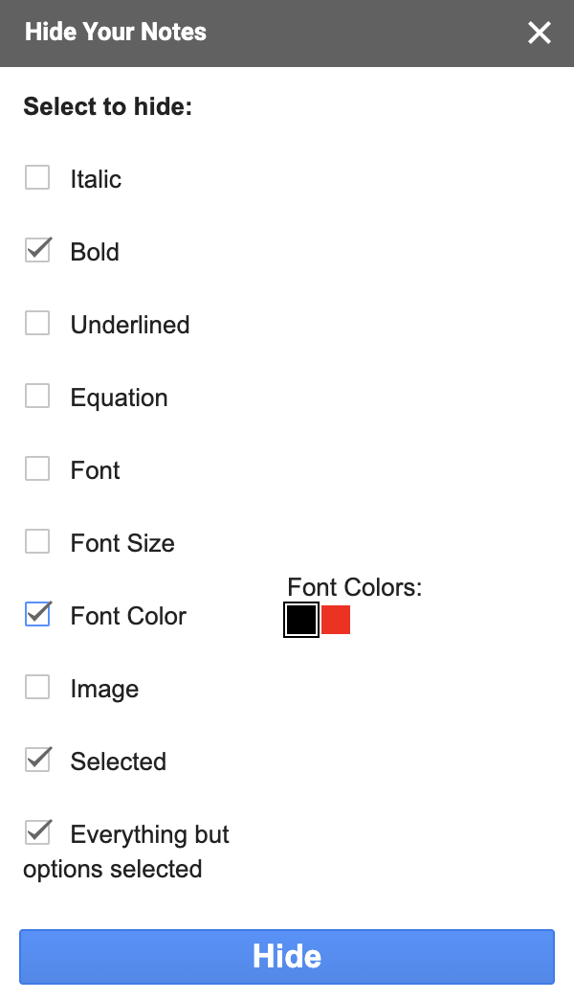

# HideYourNotes

A Google Docs Add-On to turn notes into an interactive study tool.

# How does it work?
HideYourNotes works by analysing every attributes of each component that make up Google Docs. 
Google Docs are made of many different component types, such as paragraphs, images and tables. Each component can themself contain other components. For example a paragraph component contains sentence componenst, and sentence components contains word components. 
So when the user click the 'Hide' button, all the components that match the selected attributes are hidden.

# Try it
Unfortunatly HideYourNotes is not available on the Google Docs Market just yet... The process to get it reviewed and approved is lengthy, however if you are interested in being a beta tester then:

### Request access (< 5 min)
  1. [Email me](jb.merville@gmail.com) specifying that you want to test HideYourNotes and I will add you to a collaborative Document where you can access the Add-On
  
### Recreating the project (< 10 min)
  1. Open a new Google Docs Add-On project following this short [tutorial](https://developers.google.com/gsuite/add-ons/editors/docs/quickstart/translate)
  2. Copy the content of HideYourNotes.js into Code.gs
  3. Copy the content of ui.html into sidebar.html
  4. Test the Add-On on a document: Run > Test as add-on... > Select Doc > Test
  
 # What's next for HideYourNotes
Currently I hope to bring HideYourNotes onto the Google Docs Market and grow our userbase in hopes of gaining constructive feedback and catching bugs! With the data and feedback provided, I hope to issue more updates and features, whilst removing the unused ones.

